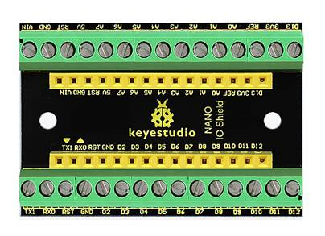
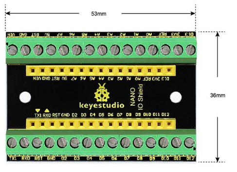
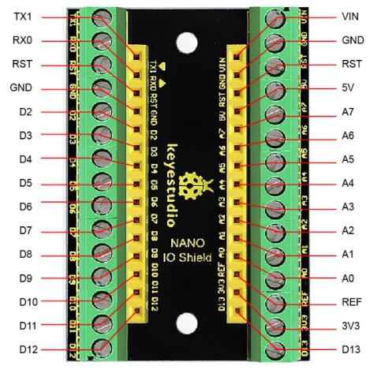
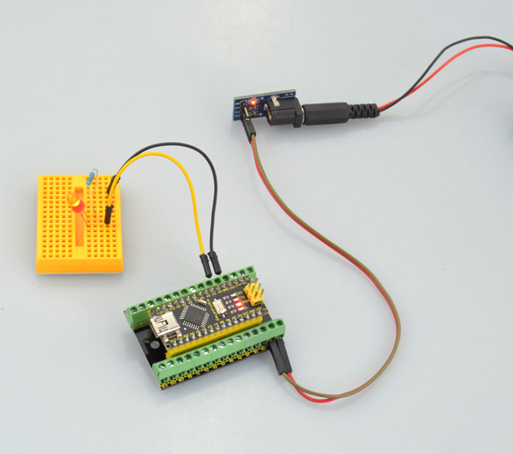

# KS0250 keyestudio NANO IO Shield

## 1. Introduction

This is a simple and small NANO IO shield. It breaks out all the pins of keyestudio Nano ch340, easy to hook it up to make experiments. Onboard comes with two 3mm fixed holes, convenient to fix the shield on other objects.

## 2. Parameters

- Terminal block spacing: 3.5mm
- Female header pitch: 2.54mm

## 3. Controller Compatible

- keyestudio Nano ch340

## 4. Technical Details

- **Dimensions:** 53mm x 36mm
- **Weight:** 20.5g

## 5. PINOUT

Those interfaces marked red line are connected.

## 6. Example Use

Stack the NANO CH340 onto the shield, and upload well the code, you could power the Nano ch340 via VIN GND interface to light up an external LED.

